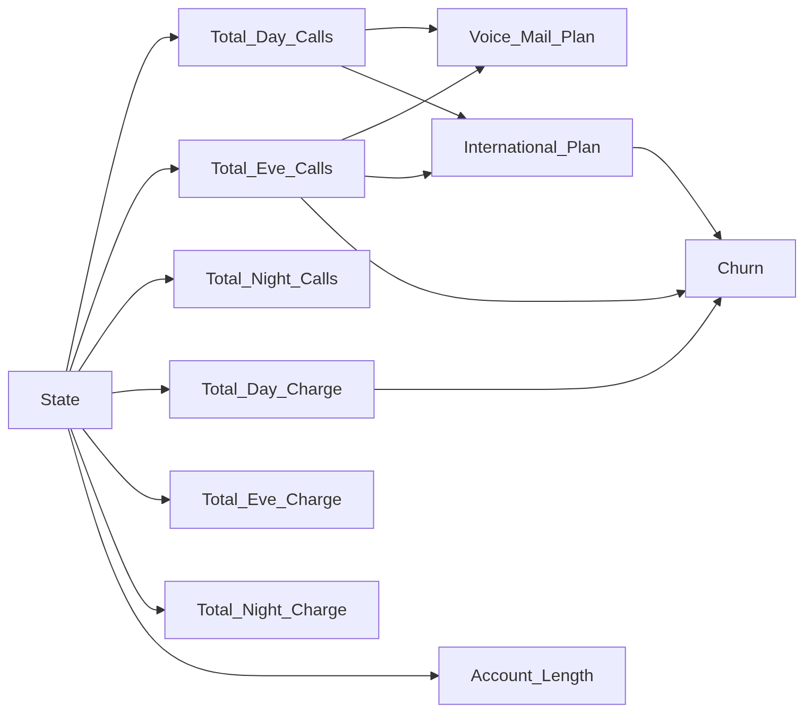

## Distribution Types

### 1. Normal distribution
- Account length
- Total day/eve/night calls
- Total day/eve/night charge
- Total intl charge

### 2. Bernouli / Categorical distribution
- State / Area Code
- Coustomer service calls
- Total intl calls

---

## Covariance Tests

### Results

    Account length, Total day calls :: 0.0003210470659675421
    Account length, Total day charge :: 0.0014862999320722904
    Account length, Total eve calls :: 0.0008109693402345335
    Account length, Total eve charge :: 0.0012496433373159492
    Account length, Total night calls :: 0.001630006151200216
    Account length, Total night charge :: 0.0019769960307031
    Total day calls, Total day charge :: 0.0017831389580328315
    Total day calls, Total eve calls :: 0.0031545949127942154
    Total day calls, Total eve charge :: 0.0023748050666079876
    Total day calls, Total night calls :: 0.0017694281972593672
    Total day calls, Total night charge :: 0.0009094349731468877
    Total day charge, Total eve calls :: 0.0022392732466687574
    Total day charge, Total eve charge :: 0.002206617858515642
    Total day charge, Total night calls :: 0.0021698682360012356
    Total day charge, Total night charge :: 0.0019898133760747013
    Total eve calls, Total eve charge :: 0.002760218843157902
    Total eve calls, Total night calls :: 0.0023105495053433274
    Total eve calls, Total night charge :: 0.001502486930809972
    Total eve charge, Total night calls :: 0.0022713025405638734
    Total eve charge, Total night charge :: 0.0018485763601440493
    Total night calls, Total night charge :: 0.0021518733021589982

All normally distributed attributes are independent \
**NOTE: International calls are excluded**

---

## Distrib Conditioning Tests

### Procedure

- Target Distrib = p(X, Y)
- Conditioning attrib => Y
1. Compute p(X | Y)
2. Quantify the divergence b/w P(X | Y) and P(X) using KL / KS Tests.
3. If p(X | Y) ~ p(X) => X and Y are assumed to be independent.

### Results

#### 1. (Categorical, Categorical)

    Churn, State :: 0.01623738903306962
    Churn, International plan :: 0.10074717884728941 <<
    Churn, Voice mail plan :: 0.00939321996608546
    State, International plan :: 0.013470241995559505
    State, Voice mail plan :: 0.004159965429027223
    International plan, Voice mail plan :: 3.4064460068001644e-06

#### 2. (Uniform, Categorical)

    Account length, Churn :: 0.02375366171212959
    Account length, State :: 0.8947756928956713 <<
    Account length, International plan :: 0.04446093886943214
    Account length, Voice mail plan :: 0.027888805125517994
    Total day calls, Churn :: 0.02407213156201399
    Total day calls, State :: 1.0564304001707827 <<
    Total day calls, International plan :: 0.12733789019169486 <<
    Total day calls, Voice mail plan :: 0.15667627841692822 <<
    Total day charge, Churn :: 0.1443259788296036 <<
    Total day charge, State :: 0.7502246665829467 <<
    Total day charge, International plan :: 0.042381343572454
    Total day charge, Voice mail plan :: 0.03190833881292711
    Total eve calls, Churn :: 0.18622583002819615 <<
    Total eve calls, State :: 1.0659846629051466 <<
    Total eve calls, International plan :: 0.2830928789085195 <<
    Total eve calls, Voice mail plan :: 0.28284353838362103 <<
    Total eve charge, Churn :: 0.08907305624277961
    Total eve charge, State :: 0.8427769946028176 <<
    Total eve charge, International plan :: 0.09896356891319284
    Total eve charge, Voice mail plan :: 0.024128246344504837
    Total night calls, Churn :: 0.04408580305820728
    Total night calls, State :: 0.7840983449028581 <<
    Total night calls, International plan :: 0.037759132201809695
    Total night calls, Voice mail plan :: 0.015250155541880195
    Total night charge, Churn :: 0.06024729790437027
    Total night charge, State :: 0.9779171149157396 <<
    Total night charge, International plan :: 0.041175914590756216
    Total night charge, Voice mail plan :: 0.006275568720859056

**NOTE: The attrib pairs marked with "<<" are dependent.**

---

## Model Structure

---
